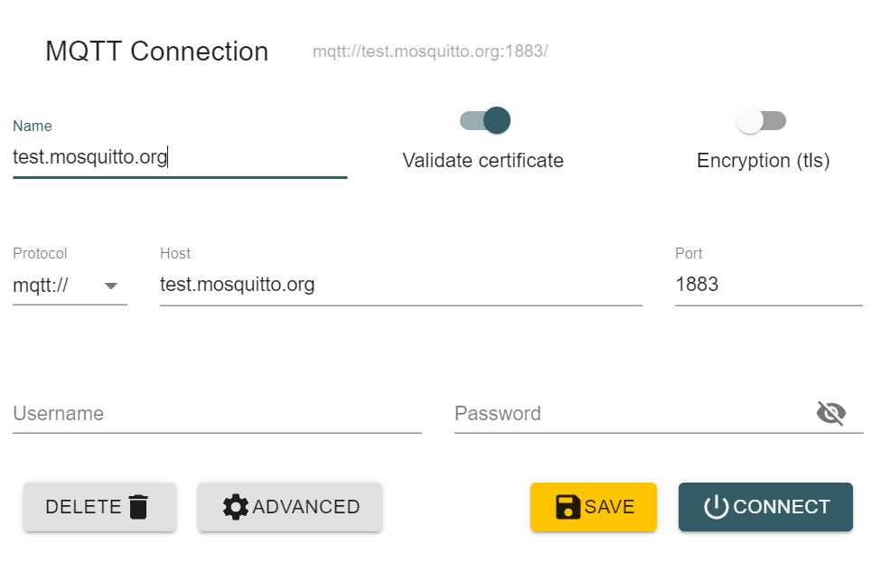
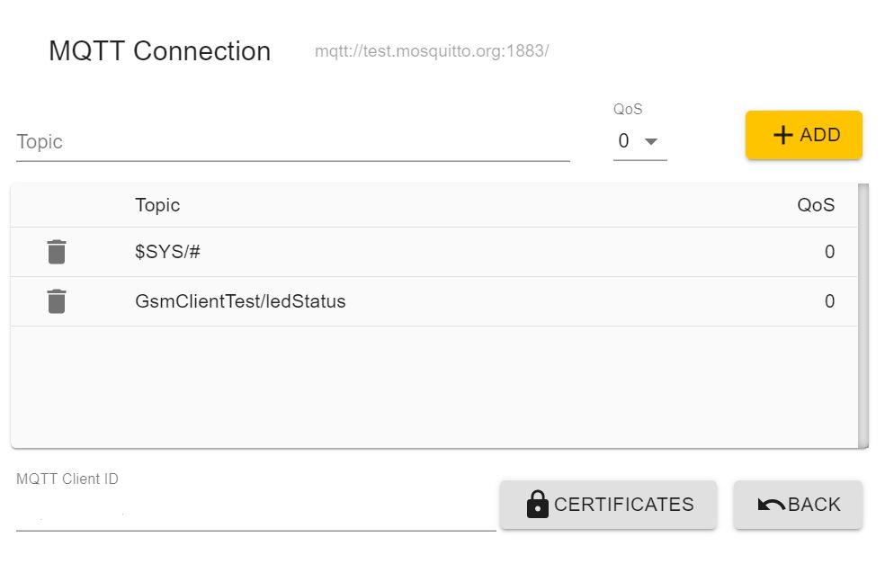

 # MQTT client test
 
This example connects to test.mosquitto.org.
 
You can quickly test sending and receiving messages from the MQTT Explorer app
 available at http://mqtt-explorer.com/
 
 * Subscribe to the topic GsmClientTest/ledStatus
 * Publish "toggle" to the topic GsmClientTest/led and the LED on your board
 should toggle and you should see a new message published to
 GsmClientTest/ledStatus with the newest LED status.

## MQTT Explorer settings

